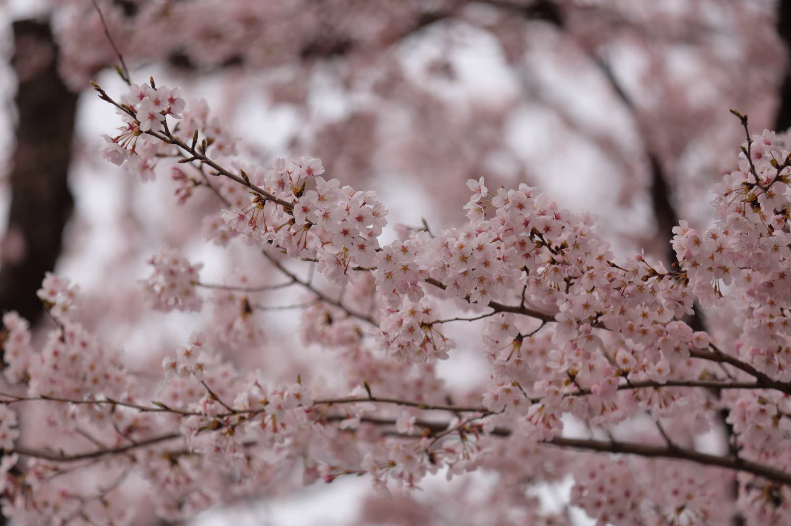
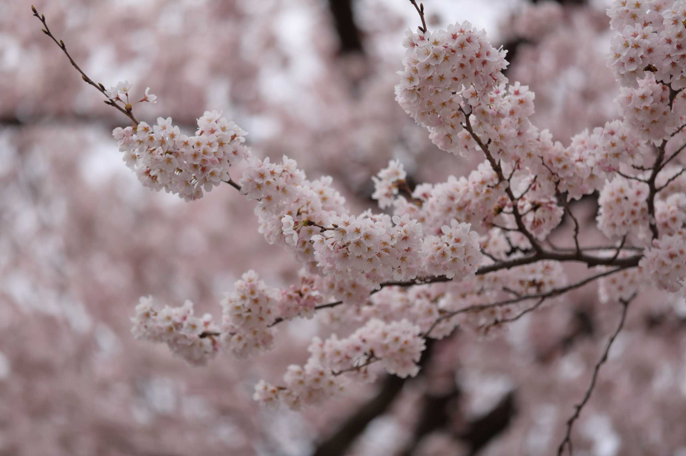

# sakura

<html>
<head>

<meta charset="UTF-8">
<meta http-equiv="Content-Type" content="text/html; charset=UTF-8">
<meta http-equiv="X-UA-Compatible" content="IE=EmulateIE10" />
<meta http-equiv="X-UA-Compatible" content="IE=edge">

<!--ここから上はお決まりの定型文です-->

<!--ここからが表現の書式などを決めるcssという部分-->

<link href="https://cdnjs.cloudflare.com/ajax/libs/lightbox2/2.7.1/css/lightbox.css" rel="stylesheet">

</head>

<body>

 
	

  モバイル端末をお使いの場合は、画面を横向きにすると
  より見やすくご覧頂けます。

    
	
	

 アクセス用QRコード

<marquee direction="left" scrollamount="20" width="30%">(^_^)/~hada</marquee>

<h1><marquee behavior="alternate">!!! 2022年4月3日、公園の桜が満開 !!!</marquee></h1>

<!--	
 
泳法の進化研究会が取りまとめた図書から、四角囲みの部分だけを取り出しました。 ほとんどの部分は水泳の先生たちが読むような難しい記述ですので割愛しました。

 
-->

	

                                    
         
	
	
<!-- フッタ -->
 <footer>
	 <h2>
 撮影日、場所：2022/04/03(日)、栃木県宇都宮市岡本町、台ハイツ西公園
		 </h2>
	</footer>	

<!--HPにさまざまなJavaScriptを呼び込むための書式-->

</body>

</html>
